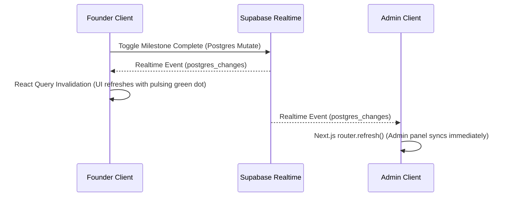

# Polaris — Venture Incubation & Command Center

Welcome to **Polaris**, a state-of-the-art, enterprise-grade Venture Incubation & Ecosystem Management Platform. Built for modern startup accelerators, technology business incubators, and university venture programs, Polaris streamlines the entire startup lifecycle—from competitive application vetting to milestone telemetry tracking, mentorship logging, investment diligence, and cohort administration.

By unifying founders, administrators, mentors, and investors into a single cohesive, high-performance command center, Polaris removes operational friction and allows early-stage companies to focus entirely on growth velocity and technical scale.

---

##  Design System & Aesthetics
Polaris is built with a premium, sleek visual identity inspired by modern SaaS interfaces:
- **Tailored Palettes**: High-contrast dark and light modes built around elegant HSL colors (Zinc, Slate, and Cobalt).
- **Dynamic Micro-Animations**: Built-in visual feedback with smooth hover effects and responsive page entries using Tailwind's animation primitives.
- **Data Visualizations**: Responsive charts using Recharts that translate raw venture activities into beautiful, actionable intelligence.
- **Glassmorphism & Contrast**: Layered cards, custom gradients, and border-border structures that convey a highly polished, state-of-the-art presentation.

---

##  Key Roles & Feature Catalog

Polaris separates governance and operations into five distinct, role-based workflows:

###  1. Admin Control Panel
The ultimate ecosystem dashboard for program directors and operations managers:
- **Governance**: Overview of all incubated startups, user management tables, and cohort tracking.
- **Evaluation & Scoring**: Interactive review screens to score applications (Team, Market, Traction, Uniqueness) out of 10.
- **Ecosystem Analytics**: Real-time Recharts visualizations showing milestone distribution, funding per startup, and session engagement.
- **Mentor Matching**: Dynamic assignment dropdowns to match seasoned advisors with specific startups.

###  2. Founder Suite
A focused workspace for early-stage teams to build momentum and log milestones:
- **Milestone Telemetry**: Live milestone lists with interactive complete/pending toggles, real-time sync with Supabase Postgres listeners, and an animated green **"Live"** telemetry indicator.
- **Application Portal**: Multi-step program application forms.
- **Venture profile**: Central repository for company sector, stage, elevator pitch, target market, and revenue model.

###  3. Investor Deal Flow
A secure, read-only observer platform for venture capitalists and angel networks:
- **Advisory Banner**: Prominent warning explaining secure read-only privileges.
- **Discovery Portal**: Quick-scan lists of active startups, showing completion percentages, stage, sector, and total capital raised.
- **Milestone Velocity Chart**: Dynamic Recharts LineChart showing milestone completions over time.

###  4. Mentor Hub
A structured interface for architectural advisors and program partners:
- **Session logs**: Dynamic scheduling and log forms to document advisory feedback, notes, and session ratings (1-5).
- **Cohort Oversight**: Fast lookup of assigned startups and active advisory portfolios.

###  5. Manager Dashboard
An operational command center focused on cohorts, events, and scheduling:
- **Event Coordination**: Administrative control over program workshops, mid-cohort reviews, and Demo Day.

---

## 
- **Framework**: [Next.js 14 App Router](https://nextjs.org/) (utilizing Server Components, Server Actions, Middleware protection)
- **Database**: [Supabase](https://supabase.com/) (PostgreSQL, Realtime Postgres Changes, SSR Client generation)
- **State Management**: [TanStack React Query v5](https://tanstack.com/query) (for optimized query caching and stale-time management)
- **Forms & Validation**: [React Hook Form](https://react-hook-form.com/) combined with [Zod schemas](https://zod.dev/) for server-to-client data validation.
- **Styling**: [Tailwind CSS](https://tailwindcss.com/) with [shadcn/ui](https://ui.shadcn.com/) components for consistent typography, borders, and transitions.

### Realtime Synchronization Flow



---

##  Project Structure

```
├── app/                  # Next.js 14 App Router pages, layouts, and sub-dashboard groups
│   ├── (auth)/           # Authentication flows (login, registration)
│   ├── (dashboard)/      # Protected multi-role dashboards (admin, founder, mentor, investor, manager)
│   ├── api/              # API Route Handlers
│   └── globals.css       # Core stylesheet with HSL tokens and dark-mode parameters
├── components/           # Atomic UI elements and layouts
│   ├── portfolio/        # Portfolio analytics components
│   ├── shared/           # Cross-dashboard layouts (sidebar, loading spinner, error layouts)
│   └── ui/               # Standard shadcn primitives (Card, Button, Dialog, Input, Skeleton)
├── lib/                  # Helper modules and hooks
│   ├── actions/          # Type-safe Next.js Server Actions
│   ├── hooks/            # Custom React Query Hooks (use-analytics, use-milestones, use-startups)
│   ├── supabase/         # SSR Supabase Client definitions (browser, server, middleware)
│   └── validations/      # Zod validation schemas (milestones, applications, profiles)
├── scripts/              # Command-line utility scripts (seed-demo.ts)
└── types/                # TypeScript interfaces and auto-generated database types
```

---

##  Getting Started & Setup

### 1. Clone & Install Dependencies
```bash
git clone https://github.com/darshanashok-dev/int-project.git
cd int-project
npm install
```

### 2. Configure Environment Variables
Copy `.env.example` to `.env.local` and add your database credentials:
```bash
cp .env.example .env.local
```
Fill in the following keys in your `.env.local` file:
```env
NEXT_PUBLIC_SUPABASE_URL=your-supabase-project-url
NEXT_PUBLIC_SUPABASE_ANON_KEY=your-supabase-anon-key
SUPABASE_SERVICE_ROLE_KEY=your-supabase-service-role-key
NEXT_PUBLIC_MOCK_MODE=false
```

### 3. Database Seeding
To populate the database with complete, high-fidelity demo data (Programs, active Startups, Milestone metrics, Sessions, Funding rounds, and Cohort events), run our idempotent seeder:
```bash
npx tsx scripts/seed-demo.ts
```

### 4. Run Development Server
Start the Next.js local server:
```bash
npm run dev
```
Open [http://localhost:3000](http://localhost:3000) in your browser to explore the platform. Use our **Quick Demo Credentials** on the Sign In page to fast-track your presentation tour across all roles.
